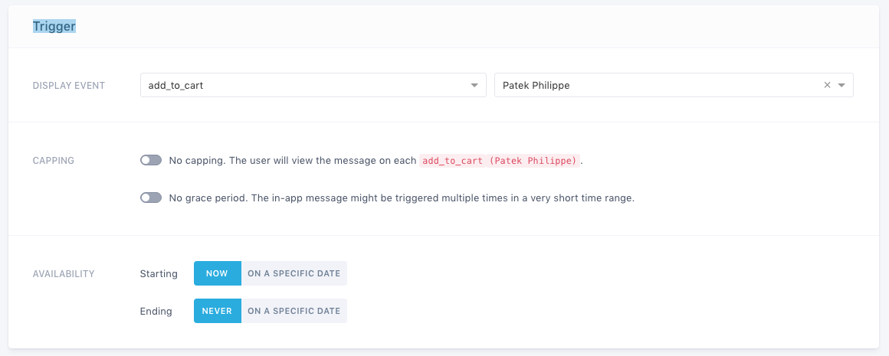

# Batch store
Sample mCommerce (Batch Store) for sales.
This sample is a full fledged example meant to show both basic and advanced integrations of the Batch SDK with a real-world use case.  

# How run it
* Clone this repository
* Follow this instructions about prerequisites [https://batch.com/doc/android/prerequisites](https://batch.com/doc/android/prerequisites.html). You will need to associate the project to a Firebase Project to continue.
* Batch SDK is already installed, you have to setup Batch with your API KEY in build.gradle : `buildConfigField "String", "API_KEY", '"<YOUR API KEY HERE>"'` Make sure you keep `'"` before your API Key and `"'` after, they are needed to make a working string constant.
* Build gradle
* Run your app, open the Logcat tab of Android Studio. You should see the following logs :

```
Batch (<version>) is running in dev mode (your API key is a dev one)
Installation ID: <your installation ID>
```
More informations : [https://batch.com/doc/android/sdk-integration](https://batch.com/doc/android/sdk-integration.html#_your-first-start)

# In App Messaging

Well, installation's over you can setup your first In App campaign.

### How sample work
In-App campaigns will appear on your users’ screen according to a specific trigger.
For example, you can choose to display an In-App promoting a discount when a user add one article to cart.

Sample app contains 3 triggers 
```kotlin
// Track when the user select an article
fun trackArticleVisit(article: Article){
    Batch.User.trackEvent("ARTICLE_VIEW", article.name)
}
// Track when the user add article to cart
fun trackAddArticleToCart(article: Article){
    Batch.User.trackEvent("ADD_TO_CART", article.name)
}

// Track when the user proceed to checkout
fun trackCheckout(amount: Double){
    Batch.User.trackEvent("CHECKOUT")
    Batch.User.trackTransaction(amount)
}
```
This triggers can be use in the Batch dashboard with labels. 
More details here : https://batch.com/doc/dashboard/in-app-messaging/campaign-edition.html#_trigger-condition

**Example :**
- Create campaign
- Set trigger **display event** : `add_to_cart`
- Set **label** : `Patek Philippe` (If you don’t select any labels, Batch will trigger the message on every trigger of the selected event)

- Setup message edition on the interface

In app, if you select Patek Philippe in your cart, you will see In App messaging.


## Resources
* [Full Batch documentation](https://dashboard.batch.com/doc)
* [support@batch.com](support@batch.com)
